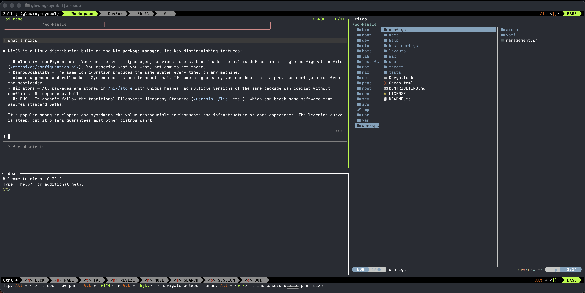

# Devbox

[](LICENSE)
[](https://www.rust-lang.org/)

**The sandbox that AI coding agents deserve.** Isolated developer VMs where Claude, Codex, and Aider can write, build, and test code freely -- without ever touching your host machine.

```bash
cd my-project
devbox
```

That's it. Devbox detects your project type, provisions a NixOS VM with [90+ tools](#tool-catalog), and drops you into a workspace with AI coding assistants, a brainstorming panel, file browser, and git -- all pre-configured and ready to go.

### Why a sandbox for AI coding?

AI coding agents are powerful, but they need guardrails. They `rm -rf` the wrong directory. They overwrite config files. They install conflicting dependencies. When an agent runs on your host machine, every mistake is permanent and every action is a security risk.

Devbox solves this by giving each project a **full VM sandbox** with read-only host mounts:

- **Your host stays pristine.** No dev tools, no language runtimes, no global npm packages, no Docker images piling up. Everything lives inside disposable VMs. Uninstall a sandbox and it's gone -- zero residue on your machine.
- **AI agents can't break your system.** The host filesystem is mounted read-only via OverlayFS. Agents write freely inside the VM, but nothing touches your real files until you explicitly run `devbox commit`.
- **Every change is reviewable.** Run `devbox diff` to see exactly what the agent modified. Accept what's good, discard the rest. It's like a code review for your filesystem.
- **Mistakes are free.** Bad refactor? Agent went rogue? `devbox discard` throws away everything and you're back to clean state. `devbox snapshot restore` rolls back even further.
- **Audit and policy control.** Full VM isolation means you can enforce security policies, restrict network access, and audit every action. Run untrusted code, test third-party packages, or let junior developers experiment -- all without risk to production systems.
- **Multiple agents, zero conflicts.** Each sandbox is independent. Run Claude in one, Codex in another, with different tool versions and configurations. No interference.

### Default Workspace Layout



Four tabs, ready to go: **Workspace** (AI coding + brainstorm + file browser), **DevBox** (monitor + help + management), **Shell** (plain terminal), and **Git** (lazygit).

### It's not just for AI

Devbox is a complete developer environment for everyone:

| Problem | Devbox Solution |
|---------|----------------|
| "It works on my machine" | Reproducible NixOS VMs with declarative configuration |
| Polluting your host OS with dev tools | Everything runs in an isolated VM; your host stays clean |
| Tool version conflicts | Each sandbox is independent with its own package set |
| Setting up a new machine takes hours | One command installs [90+ tools](#tool-catalog) from a binary cache in minutes |
| Security and compliance requirements | Full VM boundary with audit trail via overlay diff/commit |

## Key Design Principles

- **AI-first workspace** -- Pre-configured layouts for AI pair programming. Claude Code, Codex, Aider, and aichat are installed and ready. The default layout opens an AI coding assistant, a brainstorming panel, and a file browser side by side.
- **Safe by default** -- Host filesystem is read-only via OverlayFS. All writes happen in an isolated overlay layer. Changes sync to host only with explicit `devbox commit`. AI agents and developers alike can experiment without fear.
- **Zero configuration** -- Auto-detects Go, Rust, Python, Node, Java, Ruby from project files and installs the right toolchain.
- **Clean abstraction** -- The CLI provides a consistent interface across VM runtimes (Lima, Incus, Multipass, Docker). Switch runtimes without changing workflows.
- **Self-contained binary** -- All NixOS configurations, layouts, and help files are compiled into a single binary. No external dependencies beyond a VM runtime.
- **User-friendly** -- Built-in cheat sheets (`devbox guide <tool>`), TUI package manager, interactive layout picker, and comprehensive error messages with suggested fixes.

---

## Quick Start

### Prerequisites

- **Rust** 1.85+ (to build from source)
- A VM runtime:
  - [Lima](https://lima-vm.io/) (macOS, recommended)
  - [Incus](https://linuxcontainers.org/incus/) (Linux, recommended)
  - [Multipass](https://multipass.run/) (macOS/Linux)
  - [Docker](https://www.docker.com/) (any platform, fallback)

### Install

```bash
git clone https://github.com/ethannortharc/devbox.git
cd devbox
cargo install --path .
```

### Verify your system

```bash
devbox doctor
```

### Create your first sandbox

```bash
# Auto-detect project and create sandbox
cd my-project
devbox

# Or be explicit
devbox create --name myapp --tools go,docker --layout ai-pair

# Ubuntu base image instead of NixOS
devbox create --image ubuntu --tools python
```

### Common workflows

```bash
# Attach to an existing sandbox
devbox shell --name myapp

# Run a one-off command inside the sandbox
devbox exec --name myapp -- make test

# See what files changed in the overlay
devbox diff

# Sync overlay changes back to host
devbox commit

# Discard all changes (safe reset)
devbox discard

# Stop or destroy
devbox stop --name myapp
devbox destroy --name myapp
```

### Working with layouts

```bash
devbox layout list                # Show all available layouts
devbox layout preview ai-pair     # ASCII preview of a layout
devbox create --layout tdd        # Use a layout on create
devbox layout set-default tdd     # Set your global default
```

### Managing tools

```bash
devbox upgrade --tools rust       # Add Rust toolchain to running sandbox
devbox packages                   # Open TUI package manager
devbox nix add <package>          # Add any nixpkgs package
devbox guide lazygit              # Show cheat sheet for a tool
```

---

## Security Model

Devbox prioritizes protecting your host filesystem and providing safe, reversible workflows.

| Layer | Protection |
|-------|-----------|
| **OverlayFS isolation** | Host project directory mounted read-only. All writes go to an overlay layer inside the VM. |
| **Explicit commit** | Changes sync to host only when you run `devbox commit`. Review first with `devbox diff`. |
| **Snapshot & rollback** | Auto-snapshots on shell attach. NixOS generations allow full system rollback. |
| **VM boundary** | Full VM isolation (not containers). Your host OS is never modified. |
| **Credential safety** | No credentials are stored in the sandbox state. API keys are passed via environment variables, never written to disk. |
| **Writable opt-in** | Direct host mount requires explicit `--writable` flag. Default is always safe overlay mode. |

```bash
devbox diff                      # Review overlay changes
devbox commit                    # Sync to host
devbox commit --path src/        # Sync only specific paths
devbox discard                   # Throw away all changes
devbox snapshot restore <id>     # Roll back to a snapshot
```

---

## Commands

| Command | Description |
|---------|-------------|
| `devbox` | Create or attach (smart default) |
| `devbox create` | Create a new sandbox |
| `devbox shell` | Attach to a sandbox |
| `devbox exec <cmd>` | Run a command inside the sandbox |
| `devbox stop` | Stop a sandbox |
| `devbox destroy` | Remove a sandbox |
| `devbox list` | List all sandboxes |
| `devbox status` | Show detailed sandbox status |
| `devbox use <name>` | Switch sandbox to current directory |
| `devbox upgrade --tools <set>` | Add tools to a running sandbox |
| `devbox packages` | Open TUI package manager |
| `devbox diff` | Show overlay changes vs host |
| `devbox commit` | Sync overlay changes to host |
| `devbox discard` | Throw away overlay changes |
| `devbox layer status` | Overlay layer summary |
| `devbox layer stash` | Stash current overlay changes |
| `devbox layer stash-pop` | Restore stashed changes |
| `devbox layout list` | List available layouts |
| `devbox layout preview <name>` | ASCII preview of a layout |
| `devbox layout save` | Save layout preference |
| `devbox layout set-default <n>` | Set global default layout |
| `devbox snapshot save` | Create a snapshot |
| `devbox snapshot restore` | Restore a snapshot |
| `devbox guide [tool]` | Built-in cheat sheets |
| `devbox doctor` | Diagnose system issues |
| `devbox reprovision` | Re-push configs and rebuild |
| `devbox self-update` | Update devbox binary |
| `devbox init` | Generate devbox.toml |
| `devbox config show` | Show current configuration |
| `devbox nix add <pkg>` | Add a Nix package |
| `devbox nix remove <pkg>` | Remove a Nix package |
| `devbox prune` | Remove all stopped sandboxes |

---

## Tool Catalog

Devbox ships with [**90+ tools**](#core-sets-always-installed) organized into toggleable sets. All packages come from [nixpkgs](https://search.nixos.org/packages), the largest and most up-to-date package repository.

### Core Sets (always installed)

<details>
<summary><b>system</b> -- 24 packages</summary>

coreutils, gnugrep, gnused, gawk, findutils, diffutils, gzip, gnutar, xz, bzip2, file, which, tree, less, curl, wget, openssh, openssl, cacert, gnupg, gcc, gnumake, pkg-config, man-db

</details>

<details>
<summary><b>shell</b> -- 11 packages</summary>

| Package | Description |
|---------|-------------|
| zellij | Terminal multiplexer (workspace layouts) |
| zsh | Shell with autosuggestions and syntax highlighting |
| starship | Cross-shell prompt |
| fzf | Fuzzy finder |
| zoxide | Smart cd (remembers directories) |
| direnv | Per-directory environment variables |
| nix-direnv | Nix integration for direnv |
| yazi | Terminal file manager |
| micro | Simple terminal editor |

</details>

<details>
<summary><b>tools</b> -- 22 packages</summary>

| Package | Description |
|---------|-------------|
| ripgrep | Fast regex search (replaces grep) |
| fd | Fast file finder (replaces find) |
| bat | Syntax-highlighted cat |
| eza | Modern ls with icons |
| delta | Git diff viewer |
| sd | Regex find-and-replace |
| choose | Field selection (replaces cut/awk) |
| jq | JSON processor |
| yq | YAML/TOML/XML processor |
| fx | Interactive JSON viewer |
| htop | Interactive process viewer |
| bottom | System monitor (btm) |
| procs | Modern ps |
| dust | Disk usage analyzer |
| duf | Disk usage overview |
| tokei | Code statistics |
| hyperfine | Command benchmarking |
| tealdeer | Simplified man pages (tldr) |
| httpie | HTTP client |
| dog | DNS client |
| glow | Markdown renderer |
| entr | File watcher |

</details>

### Default Sets (on by default)

<details>
<summary><b>editor</b> -- neovim, helix, nano</summary>

Three terminal editors covering different preferences. Neovim for power users, Helix for modal editing with LSP built-in, Nano for quick edits.

</details>

<details>
<summary><b>git</b> -- 6 packages</summary>

git, lazygit (TUI), gh (GitHub CLI), git-lfs, git-crypt, pre-commit

</details>

<details>
<summary><b>ai-code</b> -- 5 packages (AI coding assistants)</summary>

claude-code, codex, opencode, aider-chat, aichat

</details>

### Optional Sets (off by default)

<details>
<summary><b>container</b> -- 6 packages</summary>

docker, docker-compose, lazydocker (TUI), dive (image analyzer), buildkit, skopeo

</details>

<details>
<summary><b>network</b> -- 7 packages</summary>

tailscale, mosh, nmap, tcpdump, bandwhich, trippy, doggo

</details>

<details>
<summary><b>ai-infra</b> -- 5 packages (local AI inference)</summary>

ollama, open-webui, litellm, mcp-hub, huggingface-hub

</details>

### Language Sets (auto-detected or `--tools` flag)

| Language | Detection | Packages |
|----------|-----------|----------|
| **Go** | `go.mod` | go, gopls, golangci-lint, delve, gotools, gore |
| **Rust** | `Cargo.toml` | rustup, rust-analyzer, cargo-watch, cargo-edit, cargo-expand, sccache |
| **Python** | `pyproject.toml`, `requirements.txt` | python 3.12, uv, ruff, pyright, ipython, pytest |
| **Node.js** | `package.json` | node 22, bun, pnpm, typescript, ts-language-server, biome |
| **Java** | `pom.xml`, `build.gradle` | jdk 21, gradle, maven, jdt-language-server |
| **Ruby** | `Gemfile` | ruby 3.3, bundler, solargraph, rubocop |

---

## Workspace Layouts

Pre-built [Zellij](https://zellij.dev/) layouts for common workflows. Each layout configures pane splits, commands, and working directories.

| Layout | Description |
|--------|-------------|
| `default` | AI assistant + brainstorm + file browser + monitor + git |
| `ai-pair` | AI coding + editor + terminal (pair programming) |
| `fullstack` | Frontend, backend, and database panes |
| `tdd` | Editor + test runner side-by-side |
| `debug` | Editor + debugger + logs |
| `monitor` | System metrics dashboard |
| `git-review` | Diff viewer + lazygit + editor |
| `presentation` | Wide editor, minimal chrome |

---

## Configuration

### Project-level (`devbox.toml`)

Generated with `devbox init`, auto-detects your project settings.

```toml
[sandbox]
runtime = "auto"            # auto | lima | incus | multipass | docker
image = "nixos"             # nixos | ubuntu
layout = "default"          # zellij layout name
mount_mode = "overlay"      # overlay (safe) | writable (direct)

[sets]
editor = true               # neovim, helix, nano
git = true                  # git, lazygit, gh
container = false           # docker, compose, lazydocker
network = false             # tailscale, mosh, nmap
ai_code = true              # claude-code, codex, aichat
ai_infra = false            # ollama, open-webui

[languages]
go = true                   # auto-detected from go.mod
rust = false
python = false
node = false

[resources]
cpu = 4
memory = "8GiB"
```

### Global defaults

```bash
devbox config set runtime lima
devbox config set layout ai-pair
devbox config show
```

---

## Base Images

Both images install the same 90+ tools from [nixpkgs](https://search.nixos.org/packages).

| Image | Method | Rollback | Best For |
|-------|--------|----------|----------|
| **nixos** (default) | `nixos-rebuild switch` | Full system generations | Reproducible, declarative environments |
| **ubuntu** | Nix package manager | `nix profile rollback` | Familiar base OS |

---

## Runtime Support

Devbox auto-detects the best available VM runtime on your system.

| Runtime | Platform | Priority |
|---------|----------|----------|
| Incus | Linux | Highest |
| Lima | macOS | High |
| Multipass | macOS/Linux | Medium |
| Docker | Any | Fallback |

---

## Architecture

```
devbox (single binary)
  |
  |-- CLI Layer (clap)
  |     21 commands with consistent UX
  |
  |-- Sandbox Manager
  |     Lifecycle: create -> start -> attach -> stop -> destroy
  |     State persistence at ~/.devbox/sandboxes/
  |     OverlayFS diff/commit/discard
  |
  |-- Runtime Abstraction
  |     Trait-based backends (Lima, Incus, Multipass, Docker)
  |     Auto-detection with priority scoring
  |     Uniform exec/start/stop/status interface
  |
  |-- NixOS Provisioning
  |     All .nix files embedded in binary (include_str!)
  |     Base64-encoded push via shell commands
  |     Declarative package management via nixos-rebuild
  |
  |-- Built-in Resources (compiled into binary)
        8 Zellij layouts (KDL)
        14 tool cheat sheets (Markdown)
        16 NixOS package set definitions
```

### Provisioning flow

1. VM runtime creates and boots a NixOS (or Ubuntu) image
2. Devbox pushes `.nix` config files into the VM at `/etc/devbox/`
3. NixOS module is imported into the VM's system configuration
4. `nixos-rebuild switch` installs all declared packages from binary cache
5. Devbox binary and help files are copied into the VM
6. Sandbox state is saved to `~/.devbox/sandboxes/<name>/`

---

## Development

```bash
# Build
cargo build --release

# Test (51 unit + 15 integration tests)
cargo test

# Lint
cargo clippy -- -D warnings

# Format
cargo fmt --check
```

For end-to-end testing with real VMs, see the [E2E Test Guide](docs/E2E_TEST_GUIDE.md).

## Contributing

Contributions are welcome. Please open an issue to discuss significant changes before submitting a pull request.

1. Fork the repository
2. Create a feature branch (`git checkout -b feature/my-feature`)
3. Write tests for your changes
4. Ensure `cargo test` and `cargo clippy` pass
5. Submit a pull request

## License

Licensed under the Apache License, Version 2.0. See [LICENSE](LICENSE) for details.
