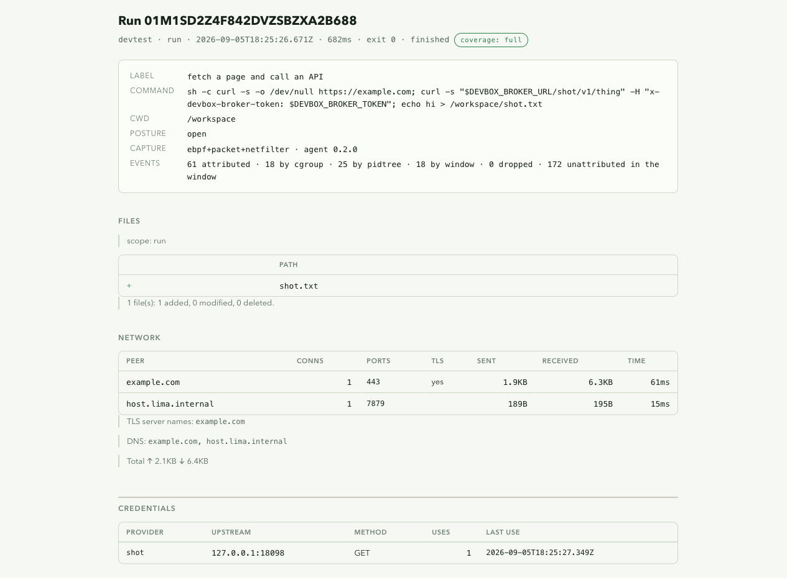

# Devbox

[](LICENSE)
[](https://www.rust-lang.org/)

**The sandbox that AI coding agents deserve.** Isolated developer VMs where Claude, Codex, and Aider can write, build, and test code freely — without ever touching your host machine, and without doing anything you cannot see.

```bash
cd my-project
devbox
```

That's it. Devbox detects your project type, provisions a NixOS VM with [120+ tools](docs/PACKAGES.md), and opens a local web console where you can watch and govern everything the box does.

v4 keeps the proven sandbox core and replaces the terminal UI with a local web
console, continuous eBPF/proc observability, live egress policy, real packet
capture, multi-node network labs, and zero-touch fabric provisioning. Start at
[the v4 quickstart](docs/quickstart-v4.md).

---

## How It Works

```bash
cd my-project
devbox                          # 1. Create sandbox (auto-detects Go, Rust, Python, etc.)

# ... AI agent writes code, installs packages, does whatever it wants ...

devbox diff                     # 2. See exactly what changed
devbox commit                   # 3. Accept the good changes
devbox discard                  # 3. Or throw everything away
```

Your project directory is mounted **read-only** inside the VM. Every file write goes to an isolated overlay layer. Nothing reaches your real files until you explicitly run `devbox commit`. It's like a code review for your entire filesystem.

v4 extends that to *behaviour*. Every process, connection, DNS lookup, and TLS
handshake is captured and correlated, so `devbox behavior diff` answers "what
did this run do that the last one didn't?" the same way `devbox diff` answers
"what files changed?" — and `devbox policy` turns the answer into enforcement.

> **Claude just `rm -rf`'d your src directory?**
> With devbox: `devbox discard`. Done. Your files were never touched.

---

## Why Devbox?

| Without Devbox | With Devbox |
|----------------|-------------|
| AI agent deletes your files | `devbox discard` — instant recovery |
| Agent installs conflicting deps | Each sandbox is isolated with its own packages |
| Dev tools pollute your host OS | Everything lives in disposable VMs — zero residue |
| "It works on my machine" | Reproducible NixOS VMs with declarative config |
| Reviewing AI changes is painful | `devbox diff` shows every change, `devbox commit --path src/` accepts selectively |
| Security and compliance concerns | Full VM boundary with audit trail |

---

## Local web console



The console manages box creation and lifecycle, streamed Nix rebuilds, Activity
and flow pcaps, egress policy, overlay files, a browser terminal, and routed Lab
topologies. It binds loopback only and gives every launch a random
`devbox-….localhost` browser origin. A one-time URL token installs a key in that
origin's storage and requests send it explicitly as `x-devbox-key`; it is never
a cookie or a navigable URL credential. Open as many tabs as you need: typing
the bound loopback address shown by `devbox web` (`http://127.0.0.1:7878` by
default) redirects each tab to the current private origin. `Host`, origin, and
framing guards protect the console. Browser profiles do not share credentials:
open the launch URL printed by `devbox web` once in each profile (for example,
once in Chrome and once in an embedded browser) before using its bare address.

---

## Workspace Layouts (removed in v4)

v3 shipped a Zellij layout subsystem — `devbox layout list`, `--layout`, custom
KDL files. v4 replaces the terminal UI with the web console, and the layout
commands and the `--layout` flag are gone with it. `devbox create --layout tdd`
is now an error rather than a silent no-op, which is the honest answer for a
flag nothing reads.

The box still has a shell; `devbox shell` attaches to it.

---

## Remote Access via SSH

Devbox VMs run a full SSH server, making them accessible from any machine on your network. This is useful for headless servers, remote development, or managing sandboxes from a different workstation.

```bash
# SSH into a sandbox directly (Lima)
ssh -p $(limactl show-ssh --format=port devbox-myapp) $(whoami)@localhost

# Or use Lima's built-in shortcut
limactl shell devbox-myapp

# Incus VMs
incus exec devbox-myapp -- bash
```

**SSH agent forwarding** is enabled by default on Lima, so your host SSH keys (for GitHub, GitLab, etc.) work seamlessly inside the sandbox — no need to copy keys.

**Port forwarding** for web development:

```bash
# Forward port 3000 from the sandbox to your host
ssh -L 3000:localhost:3000 -p $(limactl show-ssh --format=port devbox-myapp) $(whoami)@localhost

# Or use Lima's port forwarding (auto-forwards common ports)
# Access your dev server at localhost:3000 from the host browser
```

**Remote team workflow:**

```bash
# On the server: create a sandbox
devbox create --name shared-api --tools go,docker

# From your laptop: SSH in and attach
ssh yourserver -t "devbox shell shared-api"
```

---

## Quick Start

### Prerequisites

- A supported VM runtime for the default protected-overlay workspace:
  - [Lima](https://lima-vm.io/) (macOS, recommended)
  - [Incus](https://linuxcontainers.org/incus/) (Linux, recommended)

Docker is available only as an explicit, weaker-isolation base box:
`devbox create --runtime docker --image ubuntu --writable --bare`. It is not
an automatic fallback because it cannot provide the protected OverlayFS
contract. New Multipass boxes are disabled until image and read-only mount
semantics can be guaranteed; existing registered boxes remain manageable.

### Install

```bash
curl -fsSL https://raw.githubusercontent.com/ethannortharc/devbox/main/install.sh | sh
```

Or build from source (requires Rust 1.89+ and Go 1.26+; Go builds the embedded
Linux observability agent and ZTP server):

```bash
git clone https://github.com/ethannortharc/devbox.git
cd devbox
cargo install --path .
```

Release/packaging builds may supply matching binaries with
`DEVBOX_OBSD_BINARY=/path/to/devbox-obsd` and
`DEVBOX_ZTPD_BINARY=/path/to/devbox-ztpd` instead of invoking Go.

### Verify your system

```bash
devbox doctor
```

### Create your first sandbox

```bash
# Auto-detect project and create sandbox
cd my-project
devbox

# Or be explicit
devbox create --name myapp --tools go,docker

# Ubuntu base image instead of NixOS
devbox create --image ubuntu --tools python
```

### Common workflows

```bash
# Attach to an existing sandbox
devbox shell myapp

# Run a one-off command inside the sandbox
devbox exec --name myapp -- make test

# See what files changed in the overlay
devbox diff

# Sync overlay changes back to host
devbox commit

# Discard all changes (safe reset)
devbox discard

# Stop or destroy
devbox stop myapp
devbox destroy myapp
```

### Managing tools

```bash
devbox upgrade --tools rust       # Add Rust toolchain to running sandbox
devbox sets list                  # Inspect declarative sets
devbox sets apply --set system --set git --set lang-rust
devbox nix add <package>          # Add any nixpkgs package
devbox guide lazygit              # Show cheat sheet for a tool
```

---

## Security Model

Devbox prioritizes protecting your host filesystem and providing safe, reversible workflows.

| Layer | Protection |
|-------|-----------|
| **OverlayFS isolation** | Host project directory mounted read-only. All writes go to an overlay layer inside the VM. |
| **Explicit commit** | Changes sync to host only when you run `devbox commit`. Review first with `devbox diff`. |
| **Snapshot & rollback** | Auto-snapshots on shell attach. NixOS generations allow full system rollback. |
| **VM boundary** | Full VM isolation (not containers). Your host OS is never modified. |
| **Credential safety** | No credentials are stored in the sandbox state. API keys are passed via environment variables, never written to disk. |
| **Writable opt-in** | Direct host mount requires explicit `--writable` flag. Default is always safe overlay mode. |
| **Behaviour audit** | A background collector persists process, network, DNS, TLS and workspace-file events per box. |
| **Egress policy** | `allowlist`, `mirror-only`, and `isolated` postures compile to live nftables enforcement. |

```bash
devbox diff                      # Review overlay changes
devbox commit                    # Sync to host
devbox commit --path src/        # Sync only specific paths
devbox discard                   # Throw away all changes
devbox snapshot restore <id>     # Roll back to a snapshot
```

### Overlay Layer Lifecycle

The overlay layer is the bridge between your sandbox and the host. Here's the complete workflow:

```
Host filesystem ──(read-only)──> /mnt/host (lower layer)
                                      │
                                      ▼
                                OverlayFS merge ──> /workspace (what you see)
                                      ▲
                                      │
                        /var/devbox/overlay/upper (your changes)
```

| Command | Direction | What it does |
|---------|-----------|--------------|
| `devbox layer refresh` | Host → VM (read) | Re-read host changes; your edits preserved. Clears stale file handles. |
| `devbox layer conflicts` | — | Show files modified on both host and sandbox sides. |
| `devbox diff` | — | Show what's in the upper layer vs the lower layer. |
| `devbox commit` | VM → Host (write) | Copy upper layer changes to host. The **only** operation that writes to host. |
| `devbox discard` | — | Wipe the upper layer. Back to clean state. |
| `devbox layer stash` | — | Save upper layer aside for later. |

### What Happens in Each Scenario

**On `devbox layer refresh`** (re-read host files):

| Your sandbox (upper) | Host (lower) | After refresh |
|----------------------|--------------|---------------|
| Didn't touch the file | Host updated it | You see the new host version |
| You edited the file | Host didn't change | Your edit is preserved |
| You edited the file | Host also changed | **Your edit wins** (upper always overrides lower) |
| You deleted the file | Host didn't change | File stays deleted |
| You deleted the file | Host also changed | File stays deleted (your whiteout wins) |
| Didn't touch the file | Host deleted it | File disappears |
| You created a new file | — | Your new file is preserved |
| — | Host added a new file | You see the new file |

**On `devbox commit`** (sync your changes to host):

| Your sandbox (upper) | Host (lower) | After commit |
|----------------------|--------------|--------------|
| You edited a file | Host didn't change | Host gets your version |
| You edited a file | Host also changed | **Host is overwritten** with your version |
| You created a new file | File doesn't exist on host | File is created on host |
| You deleted a file | File exists on host | File is deleted on host |
| Didn't touch the file | — | No change (not in upper layer) |

> **Key rule:** `refresh` never loses your work (upper always wins in the merge). `commit` always overwrites the host with your version. Use `devbox layer conflicts` before either operation to see what overlaps.

When you run `devbox shell`, devbox automatically detects if host files changed and prompts you to refresh. Conflicts (files modified on both sides) are flagged — your sandbox version always takes precedence, but you can review and merge manually.

All layer operations are also available in the **DevBox Management Panel** inside the sandbox (press `r` for refresh, `f` for conflicts).

---

## Commands

| Command | Description |
|---------|-------------|
| `devbox` | Ensure a box for this project and open its console page |
| `devbox create` | Create a new sandbox |
| `devbox web` | Open the local web console without touching a box |
| `devbox shell` | Attach to a sandbox |
| `devbox exec <cmd>` | Run a command inside the sandbox |
| `devbox stop` | Stop a sandbox |
| `devbox destroy` | Remove a sandbox |
| `devbox list` | List all sandboxes |
| `devbox status` | Show detailed sandbox status |
| `devbox use <name>` | Switch sandbox to current directory |
| `devbox upgrade --tools <set>` | Add tools to a running sandbox |
| `devbox sets list/apply` | Inspect or rebuild the declarative set selection |
| `devbox watch` | Query or stream captured activity |
| `devbox behavior summary/diff/pcap` | Compare runs or capture a real flow pcap |
| `devbox policy show/set/allow/test/rules` | Inspect and enforce egress posture |
| `devbox lab list/up/down/status/config/fault/heal` | Operate routed network labs |
| `devbox diff` | Show overlay changes vs host |
| `devbox commit` | Sync overlay changes to host |
| `devbox discard` | Throw away overlay changes |
| `devbox layer status` | Overlay layer summary |
| `devbox layer refresh` | Pick up host-side file changes |
| `devbox layer conflicts` | Show files modified on both sides |
| `devbox layer stash` | Stash current overlay changes |
| `devbox layer stash-pop` | Restore stashed changes |
| `devbox snapshot save` | Create a snapshot |
| `devbox snapshot restore` | Restore a snapshot |
| `devbox guide [tool]` | Built-in cheat sheets |
| `devbox doctor` | Diagnose system issues |
| `devbox reprovision` | Re-push configs and rebuild |
| `devbox self-update` | Update devbox binary |
| `devbox init` | Generate devbox.toml |
| `devbox config show` | Show current configuration |
| `devbox nix add <pkg>` | Add a Nix package |
| `devbox nix remove <pkg>` | Remove a Nix package |
| `devbox prune` | Remove all stopped sandboxes |

---

## Tool Catalog

Devbox ships with [**120+ tools**](docs/PACKAGES.md) organized into toggleable sets. All packages come from [nixpkgs](https://search.nixos.org/packages), the largest and most up-to-date package repository. See the [full package reference](docs/PACKAGES.md) for detailed descriptions of every tool.

### Core Sets (always installed)

<details>
<summary><b>system</b> -- 24 packages</summary>

coreutils, gnugrep, gnused, gawk, findutils, diffutils, gzip, gnutar, xz, bzip2, file, which, tree, less, curl, wget, openssh, openssl, cacert, gnupg, gcc, gnumake, pkg-config, man-db

</details>

<details>
<summary><b>shell</b> -- 11 packages</summary>

| Package | Description |
|---------|-------------|
| zsh | Z shell with advanced scripting |
| zsh-autosuggestions | Fish-like autosuggestions for zsh |
| zsh-syntax-highlighting | Syntax highlighting for zsh |
| starship | Cross-shell prompt |
| fzf | Fuzzy finder |
| zoxide | Smart cd (remembers directories) |
| direnv | Per-directory environment variables |
| nix-direnv | Nix integration for direnv |
| yazi | Terminal file manager |
| micro | Simple terminal editor |

</details>

<details>
<summary><b>tools</b> -- 22 packages</summary>

| Package | Description |
|---------|-------------|
| ripgrep | Fast regex search (replaces grep) |
| fd | Fast file finder (replaces find) |
| bat | Syntax-highlighted cat |
| eza | Modern ls with icons |
| delta | Git diff viewer |
| sd | Regex find-and-replace |
| choose | Field selection (replaces cut/awk) |
| jq | JSON processor |
| yq-go | YAML/TOML/XML processor |
| fx | Interactive JSON viewer |
| htop | Interactive process viewer |
| bottom | System monitor (btm) |
| procs | Modern ps |
| dust | Disk usage analyzer |
| duf | Disk usage overview |
| tokei | Code statistics |
| hyperfine | Command benchmarking |
| tealdeer | Simplified man pages (tldr) |
| httpie | HTTP client |
| dog | DNS client |
| glow | Markdown renderer |
| entr | File watcher |

</details>

<details>
<summary><b>editor</b> -- neovim, helix, nano</summary>

Three terminal editors covering different preferences. Neovim for power users, Helix for modal editing with LSP built-in, Nano for quick edits. `vim` and `vi` are aliased to `nvim`.

</details>

### Default Sets (on by default)

<details>
<summary><b>git</b> -- 6 packages</summary>

git, lazygit (TUI), gh (GitHub CLI), git-lfs, git-crypt, pre-commit

</details>

<details>
<summary><b>ai-code</b> -- 6 packages (AI coding assistants)</summary>

claude-code, codex, opencode, aider-chat, aichat, continue

</details>

### Optional Sets (off by default)

<details>
<summary><b>container</b> -- 6 packages</summary>

docker, docker-compose, lazydocker (TUI), dive (image analyzer), buildkit, skopeo

</details>

<details>
<summary><b>network</b> -- 13 packages</summary>

frr, dnsmasq, chrony, busybox, iproute2, conntrack-tools, tailscale, mosh,
nmap, tcpdump, bandwhich, trippy, doggo

</details>

<details>
<summary><b>ai-infra</b> -- 5 packages (local AI inference)</summary>

ollama, open-webui, litellm, mcp-hub, huggingface-hub

</details>

### Language Sets (auto-detected or `--tools` flag)

| Language | Detection | Packages |
|----------|-----------|----------|
| **Go** | `go.mod` | go, gopls, golangci-lint, delve, gotools, gore |
| **Rust** | `Cargo.toml` | rustup, rust-analyzer, cargo-watch, cargo-edit, cargo-expand, sccache |
| **Python** | `pyproject.toml`, `requirements.txt` | python 3.12, uv, ruff, pyright, ipython, pytest |
| **Node.js** | `package.json` | node 22, bun, pnpm, typescript, ts-language-server, biome |
| **Java** | `pom.xml`, `build.gradle` | jdk 21, gradle, maven, jdt-language-server |
| **Ruby** | `Gemfile` | ruby 3.3, bundler, solargraph, rubocop |

---

## Configuration

### Project-level (`devbox.toml`)

Generated with `devbox init`, auto-detects your project settings.

```toml
[sandbox]
runtime = "auto"            # auto | lima | incus | docker (explicit limited mode)
image = "nixos"             # nixos | ubuntu
mount_mode = "overlay"      # overlay (safe) | writable (direct)

[sets]
editor = true               # neovim, helix, nano
git = true                  # git, lazygit, gh
container = false           # docker, compose, lazydocker
network = false             # FRR/lab services + network diagnostics
ai_code = true              # claude-code, codex, aider, aichat, ...
ai_infra = false            # ollama, open-webui

[languages]
go = true                   # auto-detected from go.mod
rust = false
python = false
node = false

[resources]
cpu = 4
memory = "8GiB"

[policy]
egress = "mirror-only"      # open | allowlist | mirror-only | isolated
allow = ["github.com"]
alert_on_violation = true
```

### Global defaults

```bash
devbox config set runtime lima
devbox config show
```

---

## Base Images

Both images install the same [120+ tools](docs/PACKAGES.md) from [nixpkgs](https://search.nixos.org/packages).

| Image | Method | Rollback | Best For |
|-------|--------|----------|----------|
| **nixos** (default) | `nixos-rebuild switch` | Full system generations | Reproducible, declarative environments |
| **ubuntu** | Nix package manager | `nix profile rollback` | Familiar base OS |

---

## Runtime Support

Devbox auto-detects only runtimes that implement the default NixOS protected
overlay contract. Restricted runtimes must be selected explicitly.

| Runtime | Platform | New-box support |
|---------|----------|-----------------|
| Incus | Linux | Auto-detected; NixOS overlay or Ubuntu writable |
| Lima | macOS | Auto-detected; NixOS overlay or Ubuntu writable |
| Docker | Any | Explicit only: Ubuntu + writable + bare |
| Multipass | macOS/Linux | Existing boxes only; new creation disabled |

---

## Architecture

```
devbox (single binary)
  |
  |-- CLI + local web control plane
  |     one lifecycle, policy, observability, terminal and Lab API
  |
  |-- Sandbox Manager
  |     Lifecycle: create -> start -> attach -> stop -> destroy
  |     State persistence at ~/.devbox/sandboxes/
  |     OverlayFS diff/commit/discard
  |
  |-- Runtime Abstraction
  |     Trait-based backends (Lima, Incus, Multipass, Docker)
  |     Auto-detection with priority scoring
  |     Uniform exec/start/stop/status interface
  |
  |-- NixOS Provisioning
  |     All .nix files embedded in binary (include_str!)
  |     Base64-encoded push via shell commands
  |     Declarative package management via nixos-rebuild
  |
  |-- Observability + control
  |     embedded devbox-obsd, background collector, per-box SQLite
  |     eBPF/proc capture, behavior diff, pcap, nftables policy
  |
  |-- Network Lab + ZTP
        namespaces/veth/FRR/netem, DNS/NTP/DHCP role services
        embedded devbox-ztpd, source of truth, config generation, SLOs
```

### Provisioning flow

1. VM runtime creates and boots a NixOS (or Ubuntu) image
2. Devbox pushes `.nix` config files into the VM at `/etc/devbox/`
3. NixOS module is imported into the VM's system configuration
4. `nixos-rebuild switch` installs all declared packages from binary cache
5. Matching observability/configuration agents and policy are installed
6. Sandbox state is saved to `~/.devbox/sandboxes/<name>/` and the background
   collector begins supervising it

---

## Development

```bash
# Build
cargo build --release

# Test all Rust units and integrations
cargo test

# Go agent/ZTP and Python lab toolkit
go test ./...
(cd labkit && uv run pytest)

# Lint
cargo clippy -- -D warnings

# Format
cargo fmt --check
```

For end-to-end testing with real VMs, see the [E2E Test Guide](docs/E2E_TEST_GUIDE.md).

## Contributing

Contributions are welcome. Please open an issue to discuss significant changes before submitting a pull request.

1. Fork the repository
2. Create a feature branch (`git checkout -b feature/my-feature`)
3. Write tests for your changes
4. Ensure `cargo test` and `cargo clippy` pass
5. Submit a pull request

## License

Licensed under the Apache License, Version 2.0. See [LICENSE](LICENSE) for details.
